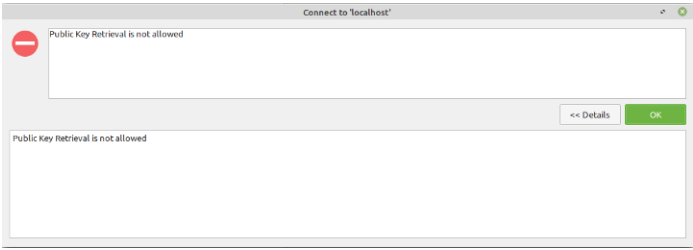
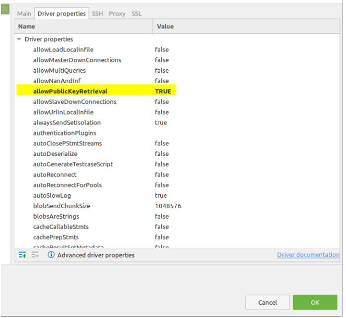

# Microservices architecture and system design with Python & kubernetes

[source yourube video](https://www.youtube.com/watch?v=hmkF77F9TLw&list=PLZGXLWkhETldQks4co5YTUV2jyJA6Cjn7&index=1&t=51s)

## What we need

1. Docker
2. Kubernetes intall tool (kubectl) ([source](https://kubernetes.io/docs/tasks/tools/install-kubectl-linux/))
   1. `sudo apt-get update`
   2. `sudo apt-get install -y ca-certificates curl`
   3. `sudo apt-get install -y apt-transport-https`
   4. `sudo curl -fsSLo /usr/share/keyrings/kubernetes-archive-keyring.gpg https://packages.cloud.google.com/apt/doc/apt-key.gpg`
   5. `echo "deb [signed-by=/usr/share/keyrings/kubernetes-archive-keyring.gpg] https://apt.kubernetes.io/ kubernetes-xenial main" | sudo tee /etc/apt/sources.list.d/kubernetes.list`
   6. `sudo apt-get update`
   7. `sudo apt-get install -y kubectl`
3. intall minikube
   Nos permite tener un cluster de kubernetes en local

   1. `curl -LO https://storage.googleapis.com/minikube/releases/latest/minikube-linux-amd64`
   2. `sudo install minikube-linux-amd64 /usr/local/bin/minikube`
   3. `minikube start --diver docker`
   4. `minikube status`

4. mysql

   Puedo descargar un contenedor con mysql

   1. `docker pull mysql`
   2. `docker run --name local-mysql -p 3306:3306 -e MYSQL_ROOT_PASSWORD=password -d mysql`
   3. Cuando intente conectarme con DBeaver si me da error de not allowed public ley retireval
   4. 
   5. cambiar esta opción en el menú de conexión
   6. 
   7. entramos en el contenedor y creamos un usuario para la bbdd
      1. create user 'auth_user'@'localhost' identified by 'password';
      2. grant all privileges on _._ to 'auth_user'@'localhost';
   8. creamos la bbdd (bien x dbeaver o comandos)

## Creación del servicio AUTH

1. creamos entorno virtual
2. instalamos paquetes con pip : pylint jedi pyjwt flask mysql-connector-python

Entramos en el contenem
