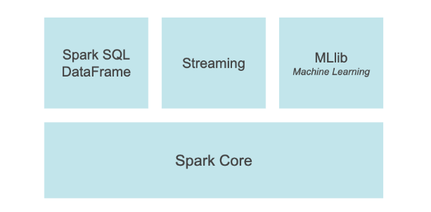

# Apache Spark

Es un framework de desarrollo para procesos de Big Data. Spark se puede implementar con 4 lenguajes de programación:

1. Java
2. Scala
3. Python
4. R

Nativamente Spark corre en Scala y éste a su vez corre en la máquina virtual de Java.

Spark hace hincapié en la velocidad de procesamiento y es por ello que preferentemente usa memoria RAM aunque tb puede usar el Disco Duro. Así los procesos que genera Spark son casi continuos, en tiempo real. 

## Base de datos según el modelo de datos

Un **modelo de base de datos** es aquello capaz de mostrar una estructura lógica de la base de datos entre las relaciones y limitaciones que se tienen para el almacenamiento y lectura de los datos.

### BBDD Relacionales

este tipo de base datos cumple con el modelo relacional y, almacena los datos en tablas organizadas por filas y columnas y que existen las llaves, con las cuales podemos crear relaciones entre tablas, siempre cuidando y asegurando la integridad de los datos.

Entre sus principales características tenemos que:

1. Nos permite almacenar datos en varias tablas, las cuales llamaremos relaciones, dichas relaciones deben de tener un nombre único dentro de la base de datos.
   
2. La forma en que se relacionan las tablas, es a través de llaves primarias y foráneas.
   
3. Interpretar a una llave primaria como la clave principal que gobiernan los registros o filas de una tabla y con la cual aseguramos la integridad de los datos.

4. Con llaves foráneas relacionaremos dos o más tablas, por ejemplo, si tenemos una tabla padre con su clave primaria, nosotros podemos crear una llave foránea la cual colocaremos en una tabla hija y, está llave foránea tendrá exactamente el mismo valor que la llave primaria de la tabla padre, con esto hemos creado una relación entre estas dos tablas.


### BBDD Transaccionales

Las bases de datos transaccionales tienen la característica especial de estar diseñadas para aquellos sistemas en que los datos cambian constantemente (**transacciones**), es decir son capaces de gestionar gran cantidad de transacciones (SELECT, UPDATE, DELETE) con una alta velocidad.  Estas bases de datos no tienen problemas de duplicidad, desnormalización o redundancia en la información. Las bases de datos transaccionales utilizan lenguaje SQL, que permite el acceso y la modificación de los datos dentro de la bases de datos.

Un punto importante es que una transacción generará un proceso atómico que puede conllevar bien operaciones de inserción, modificación o borrado de datos. Este proceso debe ser validado con un **commit** o invalidado con **rollback**; con el primero se ejecuta la operación y con el segundo no se produce, volviendo al estado original.

La base de datos transaccionales funciona de manera asociada a una base de datos relacional. Es decir, la función de la base de datos transaccionales es asegurar que las transacciones dentro de la base de datos relacional se cumplen de manera completa o, en caso de haber un error o fallo en el proceso, se reviertan y por tanto no se completen (un sistema de «todo o nada»).

En cierto sentido, la base de datos relacional nos indica cómo se almacenan los datos y la base de datos transaccional nos dice cómo se modifican esos datos.

El ejemplo clásico de transacción y el uso de este tipo de modelo es en las transferencias bancarias, donde todos los días millones de personas realizan operaciones financieras, las cuales finalmente se transforman en consultas, actualizaciones o eliminación de datos dentro de la DB.

### BBDD Multidimensionales

La definición de bases de datos multidimensionales viene marcada por la forma en la que guardan y procesan la información. Al igual que las bases de datos relacionales, almacenan la información en tablas. Sin embargo, la diferencia radica en la estructura que forman estas tablas, ya que en las bases multidimensionales los datos se ven como «cubos de información«.

Estos cubos de información añaden una nueva dimensión a las tradicionales bases de datos formadas por tablas. Los cubos están formados por dos componentes:

* Tabla de dimensiones: aquí se almacenan datos como ítems (nombre del producto, marca, etc) o fechas
* Tabla de hechos: almacena las medidas y las claves que la relaciona con las tablas de dimensiones. Por ejemplo, tamaño en centímetros o valor en euros.


Las bases de datos multidimensionales o MDB son ampliamente utilizadas en el entorno de los Data Warehouse y para aplicaciones encargadas de realizar análisis de procesos en línea. También es habitual que este tipo de bases de datos se empleen usando la información ya contenida en otras bases de datos relacionales.

Por otro lado, lo sistemas de gestión de bases de datos multidimensionales (MDDBMS) son capaces de procesar la información a gran velocidad, lo que las convierte en una herramienta muy útil para entornos o aplicaciones que requieren obtener respuestas a las consultas inmediatas o en tiempo real.


## Sistemas de manejo de la información


### OLTP (On-line TransacTion Processing)


### OLAP (On-line Analytical Processing )

Una bbdd tradicional con muchas transaciones(entradas salidas de datos, actualizaciones, etc...) en tiempo real

## WAREHOUSE

## DATA-LAKE

## Qué no es Spark


Apache Spark es un motor de análisis unificado para el procesamiento de datos a gran escala. Proporciona API de alto nivel en Java, Scala, Python y R, y un motor optimizado que admite Graphs. También es compatible con un amplio conjunto de herramientas de alto nivel, como Spark SQL para SQL y procesamiento de datos estructurados, pandas API en Spark para cargas de trabajo de pandas, MLlib para aprendizaje automático, GraphX ​​para procesamiento de gráficos y transmisión estructurada (structurated streaming) para computación incremental y procesamiento de secuencias.


Spark **no** es una base de datos, spark lo q hace es utilizar datasets q pueden provenir de un bbdd. Por ejemplo si ponemos spark a funcionar con un set de datos del tipo OLAP, con muchas transacciones, Spark funcionará muy deficientemente. Lo ideal es q spark esté conectado a teclologías tipo datawarehouse o data-lake para poder usar correctamente spark.

Podríamos decir q spark es el hermano mayor de Hadoop, es decir hereda muchas de sus características, hadoop presenta una sistema de almacenamiento de gran cantidad de datos, gracias a q es un sistema **distribuido** y clusterizado pero no está enfocado a dar una respuesta rápida ya que opera a nivel de disco duro. Spark en cambio tiene la info en RAM por lo q es más rápido aunq dependiendo del caso podemos pasarlo a duscoduro.

Spark posee:
- módulos nativos de Machine Learning, streaming y grafos
- no depende de un sistema de archivos (podemos consumir datos desde archivos planos, a archivos con extensión 
 .hdfs hadoodFileSystem, ... )

## Que son los RDDs y DataFrames

Las dos Principales estructuras que soporta Spark son los `RDD` (es el componente mínimo con el cual podemos comunicarnos con SPark) y los `DataFames`. 

La diferencia entre ambos reside es la estructura que poseen

### RDDs

Son la principal abstracción de datos, es la unidad básica de datos. Estos datos son distribuidos a lo largo de todos los clusters(de maquinas conectadas). 

- CREACIÓN DE UN RDD
  
Son muy simples de crear, ya que no tienen una estructura de datos como tal, simplemente son conjuntos de datos por ejemplo listas o tuplas. **SON INMUTABLES** una vez creados no los podemos modificar.Tienen lo q se llama `ejecución perezosa` podemos ir escribiendo código, por ejemplo leer un archivo, y si éste no funciona o tine errores no obtendremos ningún mensaje de error hasta q no realicemos una acción, es decir hasta q no le digamos a spark por ejemplo muestrame los datos o hazme un contaje de los mismos, etc... 

Así las transformaciones de los datos (orderBy, groupBy,filter, select, join,...) no supondrán un problema hasta q no realicemos las acciones (show,take,count,collect,save)

### DATAFRAME

Son una capa superior sobre los RDDs, la principal diferencia es q contiene estructura en forma de tabla, los datos se organizan en filas y columnas. Están más optimizados que los RDDs. Los podemos crear a partr de una bbdd, un archivo externo,..etc

Preferiblemnete utilizar DATAFRAMES, aunq podemos usar los RDDs para:

- Cuando te interesa controlar el flujo de Spark, ya que al trabajar con DATAFARMES el optimizador interno de SPARK realiza pequeñas modificaciones que no realiza cuando trabajamos con RDDs

- Si trabajamos con python podemos convertir un RDD a un conjunto de datos de python

- Si trabajamos con versión 1 de Spark (en esta versión no existe los dataframes) 


Cuando usar DATAFRAMES

- Cuando tengamos operaciones complicadas
- cuando vamos a realizar operaciones de alto nivel como filtros, mapeos, agregaciones,..
- Podemos aplicar sentencias SQL a los datframe

LOS RDDs POSEEN 3 CARACTERÍSTICAS BASE:

* SON DISTRIBUIDOS
* SON INMUTABLES
* SON PEREZOSOS (hasta q no ejecutemos una acción el código no corre realmente)


# Pysprak 

PySpark es una interfaz para Apache Spark en Python. No solo le permite escribir aplicaciones Spark utilizando las API de Python, sino que también proporciona el shell de PySpark para analizar de forma interactiva sus datos en un entorno distribuido. PySpark es compatible con la mayoría de las funciones de Spark, como Spark SQL, DataFrame, Streaming, MLlib (Machine Learning) y Spark Core.




## Pyspark con docker

[source](https://www.youtube.com/watch?v=_C8kWso4ne4&list=PLZGXLWkhETleNy7ilXoSDR_v-Oz1yYiWv&index=1)

primer lugar bajar la imagen de Pyspark :

arrancar el contener indicando un volumen

```
docker run --name pyspark2 -v /home/david/programming/ApacheSpark/code/:/home/jovyan/work/ jupyter/pyspark-notebook
```

## Funciones Pyspark


1. Crear un pyspark dataframe desde un pandas df
   
Si tenemos que crear un pyspark dataframe de un pandas DF es importante que el pandas_DF tenga todos los campos como string y q los registros q no tengan datos los sustituyamos por un espacio vacío, si no cuando casteemos el DF a pyspark nos dará el error de 

Can not merge type <class 'pyspark.sql.types.StringType'> and <class 'pyspark.sql.types.DoubleType'>

```python
pd_entrada = pd.read_csv('entrada.csv', sep='\t', dtype=str)
pd_entrada = pd_entrada.fillna(' ')
df_entrada = spark.createDataFrame(pd_entrada)

```


2. `F.regexp_replace()`

Esta función nos permite buscar un patrón en los datos de cada registro de una columna concreta y replazarlos por otro valor.

Por ejemplo los valores d emi columna empiezan por 0 y quiero eliminarlos y posteriormente hacer un cast a un número pues usando una expresión regular puedo hacerlo

```python

import pyspark.sql.functions as F
from pyspark.sql.types import LongType

df_cata_cntrts_0_100_DATIO_formated    = df_cata_cntrts_0_100_DATIO_formated.withColumn("nombre_columna",F.regexp_replace('nombre_columna', r'^[0]*', '').cast(LongType()))

```
Si quisiera eliminar todos los 0 incluso los que están intercalados haría:

```python

import pyspark.sql.functions as F
from pyspark.sql.types import LongType

df_cata_cntrts_0_100_DATIO_formated    = df_cata_cntrts_0_100_DATIO_formated.withColumn("nombre_columna",F.regexp_replace('nombre_columna', r'0', '').cast(LongType()))

```

Si quisiera renombrar los campos de un df, por ejemplo eliminar todos los espacios en blanco por delante y por detrás

```python

# las cabeceras de las tablas tienen espacios en blanco así q tengo q renombrarlas eliminando esos espacios

headers_entrada = df_entrada.columns
headers_entrada_update = list(map(lambda item : item.strip(),headers_entrada))

headers_salida = df_salida.columns
headers_salida_update = list(map(lambda item : item.strip(),headers_salida))

headers_trrascon = df_trrascon.columns
headers_trrascon_update = list(map(lambda item : item.strip(),headers_trrascon))

df_entrada = reduce(lambda df_entrada,idx: df_entrada.withColumnRenamed(headers_entrada[idx],headers_entrada_update[idx])  ,range(len(headers_entrada)),df_entrada  )

df_salida = reduce(lambda df_salida,idx: df_salida.withColumnRenamed(headers_salida[idx],headers_salida_update[idx])  ,range(len(headers_salida)),df_salida  )

df_trrascon = reduce(lambda df_trrascon,idx: df_trrascon.withColumnRenamed(headers_trrascon[idx],headers_trrascon_update[idx])  ,range(len(headers_trrascon)),df_trrascon  )

```
si queremos rellenar por ejemplo con '0' los datos de ciertos campos

```python
df_historico_men2010= df_historico_men2010.withColumn("GI011_COD_CBANCO2",F.lpad("GI011_COD_CBANCO",4,"0"))

# 4 hace referencia al total de caracteres que tendrá ese campo, si el dato ocupa 2 caracteres (por ejemplo 23) rellena con 0 hasta llegar a 4 caracteres (0023)
```

Función para comprobar q dos DF son iguales
```python
# utils
def are_equals(df1,df2):
    if df1.subtract(df2).rdd.isEmpty():
        return df2.subtract(df1).rdd.isEmpty()
    return False
```

Función para buscar si en algún campo de la tabla hay Null

```python
df_salida_severidad.select([count( when(col(c).isNull(), c)).alias(c) for c in df_salida_severidad.columns]).show()
```
Código para saber si hay NaNs en algún campo

```python
df_salida_severidad.filter(isnan(col('repayment_months_number'))).show()
```


# código para visualizar los DF con scroll horizontal 

```python
from IPython.display import display, HTML
display(HTML("<style>pre { white-space: pre !important; }</style>"))
```
